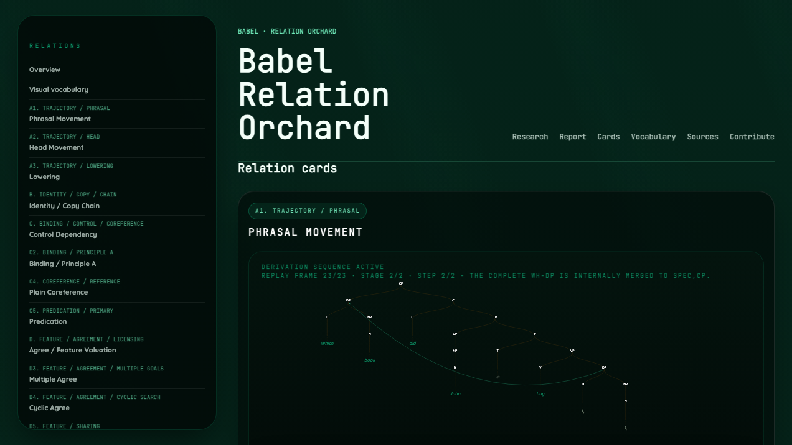

This site contains my current Babel research and the interactive Relation Orchard. Earlier experiments remain available in the archive as a record of how the project progressed and evolved.

  
<strong>Featured note.</strong> <a href="./research/relation-orchard/">Drawing an Open-Ended Syntax: The Babel Relation Orchard</a> shows how Babel turns open, model-authored syntactic relations into finite, inspectable renderer marks without pretending that deterministic code can enumerate every relation syntacticians may need.

  
Renderer completed August 25, 2026

## Current Research

- [Drawing an Open-Ended Syntax: The Babel Relation Orchard](./research/relation-orchard/)
  My report on how Babel learned to draw open-ended syntactic relations using finite renderer marks.

## Interactive Orchard

## Browse

- [Current research](./research/)
- [Open the Babel Relation Orchard](./research/relation-orchard/orchard.html)
- [Earlier Codex-generated work](./research/archive/)
