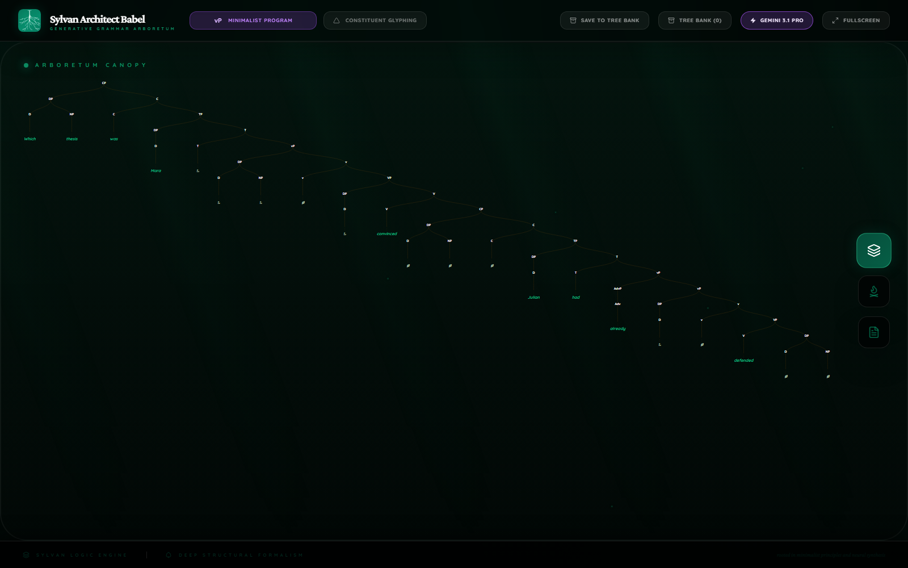
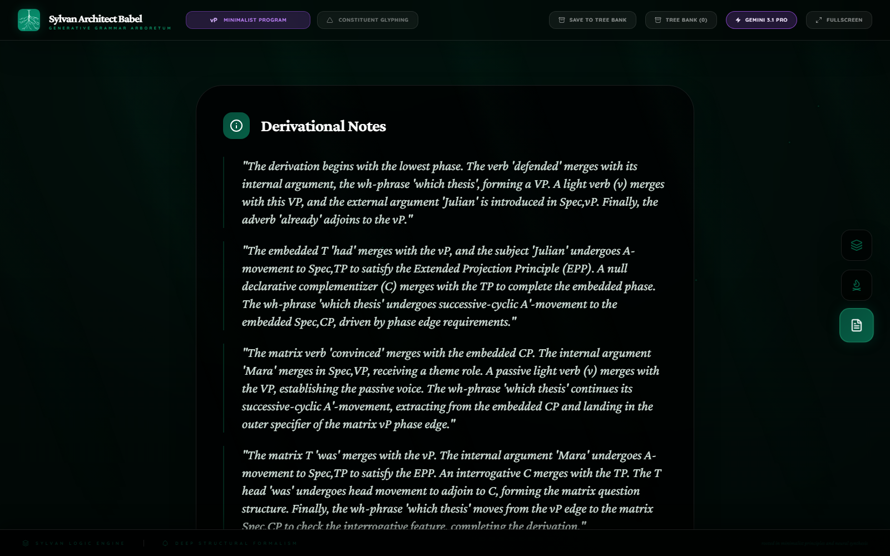
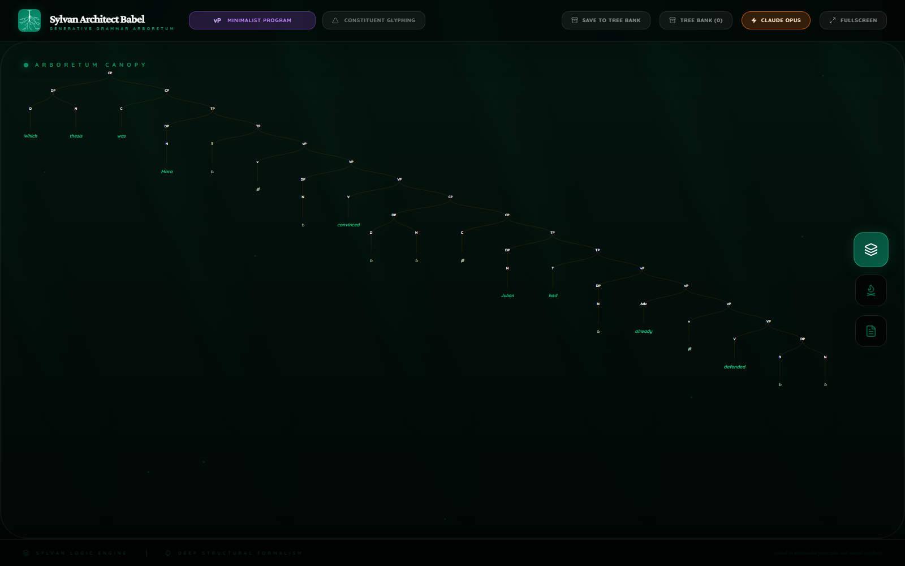
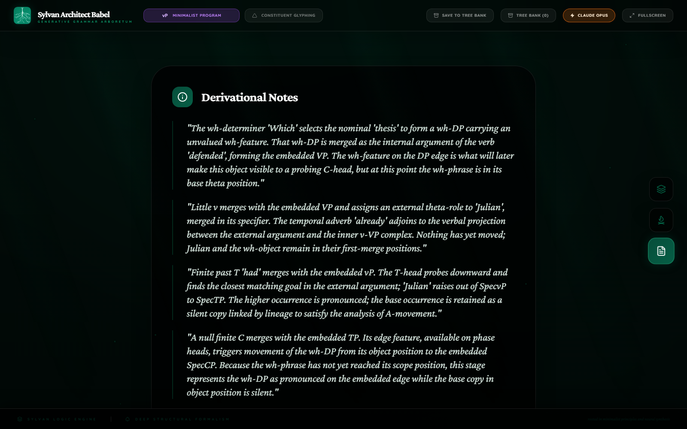
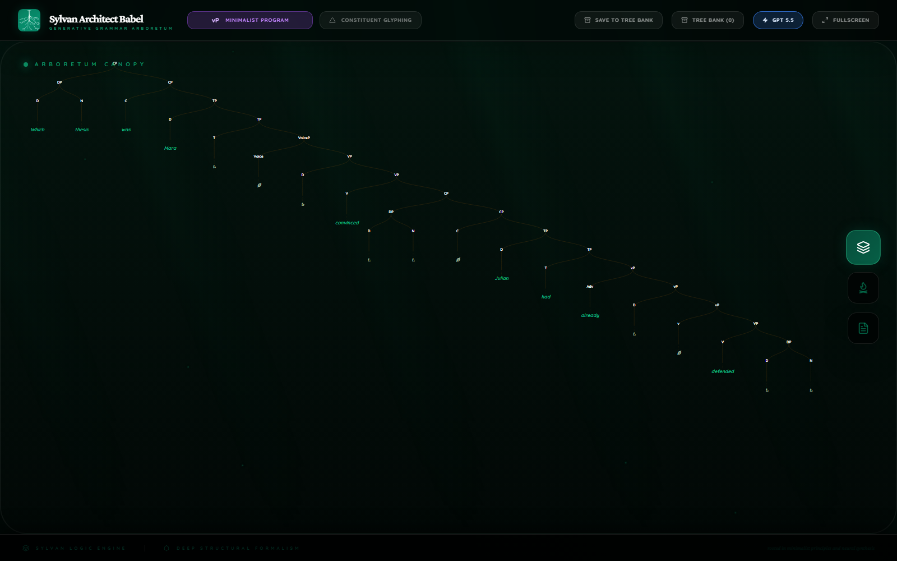
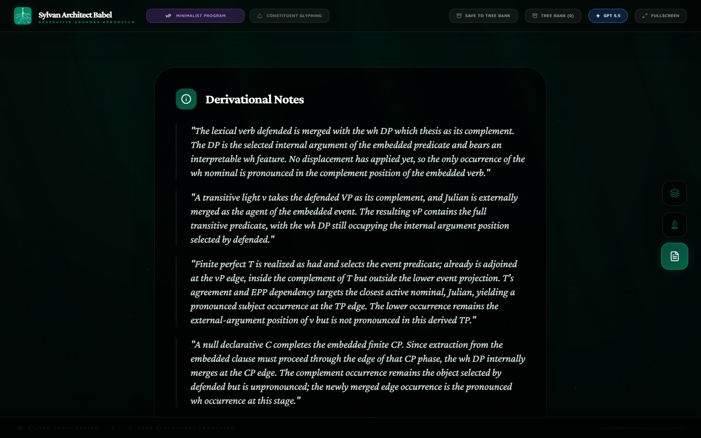

  
Mini Research Devlog

  <h1 class="paper-title">Frontier Models On A Harder Babel Derivation</h1>
  
A Babel comparison of Gemini 3.1 Pro, GPT-5.5, and Claude Opus 4.7 on a longer Minimalist wh-question with passive, embedding, and successive-cyclic movement.

  

    

      Date
      
May 31, 2026

    

    

      Sentence
      
<code>Which thesis was Mara convinced Julian had already defended?</code>

    

    

      Framework
      
Minimalist Program

    

    

      Main Site
      <a href="https://francisronge.github.io/sylvan-architect-babel/">Back to Sylvan Architect Babel</a>
    

    

      Asset Source
      <a href="https://github.com/francisronge/sylvan-architect-babel/tree/main/docs/research/assets/frontier-provider-high-thesis-2026-05">GitHub asset folder</a>
    

  

## Abstract

This run is a harder successor to the May wh-question comparison. The sentence requires a wh-object inside an embedded perfect clause, an embedded subject, a bridge predicate, a passive matrix subject, finite auxiliary inversion, and successive-cyclic movement through an intermediate edge.

Gemini and Claude both returned provider-native derivations that passed Babel normalization and rendered cleanly. GPT returned strong linguistic material, but failed the top-level Babel contract by placing later stage-shaped objects directly inside `analyses[]` instead of inside `analyses[0].derivationStages`. A shape-only diagnostic repair moved those leaked stages into the first analysis so the derivation could be inspected. That repaired GPT render is useful evidence about GPT's syntactic content, but it is not a provider pass.

The main result is that the renderer is no longer the story. The current replay captures are stable across all three inspected trees: no disappearing subtrees, no no-op frames, no unresolved movement arrows, no duplicate visible tokenIndex, and no tree-shoving camera failure. The remaining distinction is model behavior: Claude and Gemini obeyed the contract; GPT wrote an excellent derivation in the wrong top-level shape.

## Method

The benchmark used one sentence, one framework, and one high-effort provider call per route. "Harder" means harder than the earlier matrix wh-question benchmark: this sentence adds embedding, passive subject movement, perfect auxiliary structure, and successive-cyclic wh movement. It does not name a separate Babel product tier. There were no provider retries and no fallback provider calls. Raw provider output was saved for all routes.

The provider run finished on May 31, 2026. The replay assets on this page were recaptured after the June 2 renderer stabilization pass. The GPT render below is explicitly marked as a diagnostic repair because the raw GPT output did not normalize as a Babel provider response.

| Route | Model | Provider result | Stored elapsed time | Input tokens | Saved output tokens | Saved thinking/reasoning detail | Estimated API cost | Render frames |
| --- | --- | --- | ---: | ---: | ---: | ---: | ---: | ---: |
| Gemini | Gemini 3.1 Pro Preview | Passed local normalization | 115.6s | 3,836 | 3,929 visible output | 13,718 thoughts | $0.2194 | 59 |
| Claude | Claude Opus 4.7 | Passed local normalization | 287.5s | 6,103 | 25,199 output | 21,409 thinking tokens inside output | $0.6605 | 61 |
| GPT | GPT-5.5 | Failed local normalization; diagnostic repair rendered | 373.1s | 3,777 | 34,664 output | 34,664 reasoning tokens inside output | $1.0588 | 59 repaired |

The estimated API cost uses public list prices checked on June 2, 2026: Gemini 3.1 Pro Preview at $2.00 per 1M input tokens and $12.00 per 1M output tokens including thinking tokens; GPT-5.5 at $5.00 per 1M input tokens and $30.00 per 1M output tokens; Claude Opus 4.7 at $5.00 per 1M input tokens and $25.00 per 1M output tokens. The estimates exclude cached-input discounts, batch pricing, priority surcharges, taxes, subscriptions, and any non-token platform charges.

The token columns preserve the provider usage fields saved in the artifacts. They must not be added together blindly. For Gemini, the cost estimate counts visible output plus thoughts because Gemini prices output including thinking tokens. For Claude and GPT, the saved thinking or reasoning count is treated as a detail inside `output_tokens`, not as a second output total.

Pricing references: [OpenAI API pricing](https://openai.com/api/pricing/), [Claude API pricing](https://www.anthropic.com/pricing#api), and [Gemini API pricing](https://ai.google.dev/gemini-api/docs/pricing).

## Why This Sentence Is Harder

The earlier `Which book did John buy?` run tests a simple matrix object wh-question. This sentence adds four pressures:

1. The wh-object is inside an embedded clause: `Julian had already defended which thesis`.
2. The wh-object must stop at an embedded phase edge before the matrix edge.
3. The matrix predicate is passive: `Mara` is first an internal argument of `convinced`, then raises to matrix subject position.
4. The final surface order needs matrix T-to-C movement: `was Mara ...`.

A good Babel derivation therefore needs more than a final CP. It must make the lower object relation, the embedded subject relation, the matrix passive relation, and the wh-chain visible without turning future landing sites into fake syntax.

## Shared Syntactic Core

All three inspected derivations converge on the same broad analysis:

1. `which thesis` is built as the internal argument of `defended`;
2. `Julian` is introduced in the embedded verbal domain;
3. embedded T `had` raises or hosts `Julian` at the embedded TP edge;
4. the wh-DP moves to the embedded CP edge as an intermediate landing site;
5. matrix `convinced` selects the embedded CP;
6. passive structure makes `Mara` available for matrix subject movement;
7. matrix T `was` moves or is copied into C for inversion;
8. the wh-DP moves from the embedded edge to the matrix CP edge.

The important differences are contract discipline and staging. Claude gives the clearest provider-native derivational record. Gemini gives the shortest successful provider-native record. GPT gives very rich syntactic content, but violates the JSON shape that Babel needs to read the derivation as one analysis.

## Gemini 3.1 Pro

Gemini produced a compact four-stage derivation. It passed local normalization and rendered cleanly. Its strongest trait is economy: it gets from the embedded vP to the final matrix CP without excessive prose or extra analyses.

| Replay | Canopy | Notes |
| --- | --- | --- |
|  |  |  |

### Linguistic Audit

Gemini correctly identifies the embedded wh-object as the argument of `defended`, introduces `Julian` inside the embedded vP, builds the embedded perfect clause, and treats the wh-dependency as successive-cyclic. It also handles the passive matrix predicate: `Mara` originates low and moves to the matrix subject position.

The weakness is granularity. Four stages are enough for a correct public derivation, but they compress several local operations into large checkpoints. For example, the final matrix stage contains matrix T, passive subject movement, interrogative C, T-to-C movement, and final wh movement. Babel can render that now, but the model did not expose every micro-history as separate authored stages.

The positive result is that compactness no longer breaks replay. The renderer can show the derivational commitments without duplicating trees or inventing relations. The model output is not perfect as pedagogy, but it is a clean provider pass.

### Full Stage Record

#### Stage 1: Formation of the embedded vP

The derivation begins with the lowest phase. The verb `defended` merges with its internal argument, the wh-phrase `which thesis`, forming a VP. A light verb merges with this VP, and the external argument `Julian` is introduced in Spec,vP. Finally, the adverb `already` adjoins to the vP.

#### Stage 2: Formation of the embedded CP phase and intermediate wh-movement

The embedded T `had` merges with the vP, and the subject `Julian` undergoes A-movement to Spec,TP to satisfy EPP. A null declarative C merges with the TP to complete the embedded phase. The wh-phrase `which thesis` undergoes successive-cyclic A'-movement to embedded Spec,CP, driven by phase-edge requirements.

#### Stage 3: Formation of the matrix vP phase

The matrix verb `convinced` merges with the embedded CP. The internal argument `Mara` merges in the matrix verbal domain. A passive light verb merges with the VP, establishing passive voice. The wh-phrase continues its successive-cyclic A'-movement, extracting from the embedded CP and landing at the matrix vP phase edge.

#### Stage 4: Formation of the matrix CP, subject movement, and T-to-C movement

Matrix T `was` merges with the vP. `Mara` undergoes A-movement to Spec,TP to satisfy EPP. Interrogative C merges with the TP. The T head `was` undergoes head movement to C, and the wh-phrase moves from the vP edge to matrix Spec,CP to check the interrogative feature.

### Visual Relations

| Stage | Relation | Anchors |
| --- | --- | --- |
| Stage 2 | A-movement | moved: `dp_julian_2`; trace: `dp_julian_2_copy` |
| Stage 2 | A'-movement | moved: `dp_wh_2`; trace: `dp_wh_2_copy` |
| Stage 3 | A'-movement | moved: `dp_wh_3`; trace: `dp_wh_3_copy_embedded` |
| Stage 4 | A-movement | moved: `dp_mara_4`; trace: `dp_mara_4_copy` |
| Stage 4 | A'-movement | moved: `dp_wh_4`; trace: `dp_wh_4_copy_vp` |
| Stage 4 | Head movement | moved: `t_was_4`; trace: `t_was_4_copy` |

## Claude Opus 4.7

Claude produced the strongest provider-native analysis in this run. It used seven stages, separated the embedded VP, embedded vP, embedded TP, embedded CP, matrix passive vP, matrix TP, and final matrix CP. That staging makes the derivation easier to inspect than Gemini's compact four-stage version.

| Replay | Canopy | Notes |
| --- | --- | --- |
|  |  |  |

### Linguistic Audit

Claude's main virtue is ordered explanation. It does not start from the final CP and backfill. It first establishes the wh-object in its theta position, then closes the embedded verbal domain, then raises `Julian`, then moves the wh-DP to the embedded edge. Only after that does it build the matrix passive predicate around the embedded CP.

The passive analysis is also clean. `Mara` is not treated as a surface subject from the beginning. It is first the internal argument of `convinced`; passive v fails to license accusative, so matrix T attracts it to Spec,TP. This is exactly the kind of derivational lifecycle Babel is supposed to make visible.

The final CP stage combines T-to-C and final wh movement, but it does so after all required lower structure is public. That makes the final movement intelligible: `which thesis` moves from an already established embedded edge, not from nowhere.

### Full Stage Record

#### Stage 1: Embedded VP built

The wh-determiner `which` selects `thesis` to form a wh-DP. That DP merges as the internal argument of `defended`, forming the embedded VP. The wh-phrase is still in its base theta position.

#### Stage 2: Embedded vP closed

Little v merges with the embedded VP and assigns an external theta-role to `Julian`, merged in its specifier. The adverb `already` adjoins to the verbal projection between the external argument and the inner v-VP complex. Nothing has moved yet.

#### Stage 3: Embedded T and Julian movement

Embedded T `had` merges with the embedded vP. T probes downward, finds `Julian`, and raises it to Spec,TP. The higher occurrence is pronounced, and the base occurrence remains as a silent copy.

#### Stage 4: Embedded CP and intermediate wh movement

A null finite C merges with the embedded TP. Its phase-edge feature triggers movement of the wh-DP from object position to embedded Spec,CP. This stage creates the intermediate landing site for later matrix extraction.

#### Stage 5: Matrix VP and passive vP

The matrix participle `convinced` merges with the embedded CP as its propositional complement. `Mara` merges as the internal argument of `convinced`. Passive little v selects this VP, suppresses the external theta-role, and leaves `Mara` available for case-driven movement.

#### Stage 6: Matrix T and Mara movement

Finite T `was` merges with the passive vP. With no external argument in Spec,vP, T locates `Mara` and raises it to Spec,TP, valuing nominative and satisfying EPP. The lower occurrence is silent.

#### Stage 7: Matrix interrogative CP

Matrix C carries a Q-feature and an EPP feature. It attracts finite T to C, producing subject-auxiliary inversion. It also attracts the wh-phrase from embedded Spec,CP to matrix Spec,CP, completing the successive-cyclic A-bar chain.

### Visual Relations

| Stage | Relation | Anchors |
| --- | --- | --- |
| Stage 3 | A-movement chain (EPP) | head: `DPjul_s`; tail: `DPjul_b` |
| Stage 4 | intermediate A-bar movement (wh) | head: `DPwh_specCe`; tail: `DPwh1` |
| Stage 6 | A-movement chain (passive subject) | head: `DPmara_s`; tail: `DPmara_b` |
| Stage 7 | A-bar wh-chain | head: `DPwh_mtx`; intermediate: `DPwh_specCe`; tail: `DPwh1` |
| Stage 7 | T-to-C head movement | landing: `C_mtx`; source: `Twas` |

## GPT-5.5 Diagnostic Repair

GPT produced a strong derivational analysis, but it did not pass Babel's top-level output contract. The raw JSON parsed, but the top-level `analyses` array contained five entries. The first entry was an analysis with only the first four stages. Entries two through five were stage-shaped objects that should have been inside `analyses[0].derivationStages`.

That is why the raw GPT run failed normalization: Babel read the first analysis, stopped at the embedded CP, and never reached a final structure spelling the input sentence. The diagnostic render below repaired only the JSON nesting. It did not add linguistic stages, relations, or syntax.

| Replay | Canopy | Notes |
| --- | --- | --- |
|  |  |  |

### Linguistic Audit

The repaired GPT derivation is impressive as syntactic content. It uses eight stages, gives a clear embedded VP and vP, adds embedded T with `Julian` movement, moves the wh-DP to the embedded CP edge, builds the matrix passive predicate, raises `Mara`, moves `was` to C, and finally moves the wh-DP to the matrix edge.

GPT is especially clear about the bridge configuration. It says the wh occurrence at the embedded CP edge remains accessible to the matrix interrogative C, while the object occurrence inside the completed embedded phase is no longer the local goal. That is the right shape for successive-cyclic extraction.

The failure is not linguistic absence. The failure is contract bookkeeping. GPT wrote the missing stages, but put them in the wrong top-level place. For Babel as a benchmark, that still matters. A model that writes a beautiful derivation outside the required derivation container has not produced a usable provider-native Babel result.

### Full Stage Record

#### Stage 1: Embedded verb and wh object

The lexical verb `defended` is merged with the wh-DP `which thesis` as its complement. The DP is the selected internal argument of the embedded predicate and has not moved yet.

#### Stage 2: Embedded external argument

A transitive light v takes the `defended` VP as its complement, and `Julian` is externally merged as the agent of the embedded event.

#### Stage 3: Embedded T and Julian movement

Finite perfect T is realized as `had` and selects the event predicate. `already` adjoins at the vP edge. T's agreement and EPP dependency target `Julian`, yielding a pronounced subject occurrence at the TP edge and a silent lower occurrence.

#### Stage 4: Embedded CP and wh edge movement

A null declarative C completes the embedded finite CP. The wh-DP moves to the embedded CP edge so extraction can proceed through the phase edge.

#### Stage 5: Matrix passive predicate

The matrix participial verb `convinced` selects the embedded CP as its propositional complement and merges `Mara` as the internal convincee or experiencer argument. Passive Voice selects this VP and leaves `Mara` available for finite T.

#### Stage 6: Matrix T and Mara movement

Finite matrix T is realized by the passive auxiliary `was` and selects the passive VoiceP. T copies `Mara` to the TP edge, making it the pronounced matrix subject.

#### Stage 7: Matrix interrogative C and inversion

An interrogative matrix C is merged with the matrix TP. C attracts the finite auxiliary head, yielding subject-auxiliary inversion. The wh-DP remains pronounced at the embedded CP edge at this stage.

#### Stage 8: Final wh movement

The matrix interrogative C satisfies its wh feature by probing its complement. The embedded CP-edge occurrence is the accessible goal, so the wh-DP moves to matrix Spec,CP. The embedded edge occurrence and object occurrence are silent.

### Visual Relations

| Stage | Relation | Anchors |
| --- | --- | --- |
| Stage 3 | A-copy chain for the embedded subject | pronouncedSubject: `d_julian_t`; thetaPosition: `d_julian_base` |
| Stage 4 | successive-cyclic wh-copy relation inside the embedded CP | embeddedEdgeOccurrence: `dp_wh_embSpec`; thematicObjectOccurrence: `dp_wh_base` |
| Stage 6 | A-copy chain for the matrix passive subject | pronouncedSubject: `d_mara_T`; internalArgumentOccurrence: `d_mara_base` |
| Stage 7 | T-to-C head-movement chain for matrix inversion | pronouncedAuxiliaryInC: `t_was_C`; lowerTOccurrence: `t_was_lower`; interrogativeCHead: `c_matrix_null` |
| Stage 8 | successive-cyclic wh chain interpreted as the object of the embedded verb | matrixCriterialOccurrence: `dp_wh_matrixSpec`; embeddedPhaseEdgeOccurrence: `dp_wh_embSpec`; thematicObjectOccurrence: `dp_wh_base` |
| Stage 8 | preserved T-to-C head-movement chain for matrix inversion | pronouncedAuxiliaryInC: `t_was_C`; lowerTOccurrence: `t_was_lower`; interrogativeCHead: `c_matrix_null` |

## Cross-Model Comparison

### Provider Discipline

Claude and Gemini are provider passes. GPT is not. That is the sharpest operational result. GPT's linguistic content is strong, but Babel cannot treat the raw response as a successful provider parse when later derivation stages leak into sibling `analyses[]` entries.

### Derivational Granularity

Claude gives the best provider-native staging. It has enough frames to expose the embedded object position, embedded subject movement, intermediate wh movement, matrix passive subject movement, T-to-C, and final wh movement without turning the derivation into noise.

Gemini is more compact. Its four stages are linguistically coherent, but some stages bundle several operations. The current renderer can handle this cleanly, but the analysis is less teachable than Claude's.

GPT is the most granular after diagnostic repair. Its eight stages are excellent for inspection. The problem is not granularity; the problem is that the stages were placed outside the derivation container.

### Passive And Subject Movement

Claude is the cleanest on passive. It explicitly says `Mara` is first the internal argument of `convinced`, and only later raises because passive v does not license accusative. GPT says essentially the same thing in more expansive prose. Gemini captures the movement but compresses the motivation.

### Successive-Cyclic Wh Movement

All three recognize that `which thesis` cannot simply jump from the object position to the matrix edge as an ungrounded surface operation. Claude and GPT make the intermediate embedded CP edge especially clear. Gemini also has an intermediate stage, but the explanation is shorter.

### Renderer Result

This run became useful only after renderer stabilization. The final inspected captures are stable:

- Gemini: 59 replay frames, no visual regressions found.
- Claude: 61 replay frames, no visual regressions found.
- GPT diagnostic repair: 59 replay frames, no visual regressions found.

That matters for Babel as a benchmark. If the renderer invents, hides, or teleports structure, model comparison becomes impossible. In this run, the visual evidence is finally clean enough to let the model-output differences matter.

## Benchmark Takeaway

Claude wins this harder run as the best complete provider-native Babel result. It obeys the contract, gives strong staging, and provides a serious Minimalist analysis of the embedded wh-chain and passive matrix subject.

Gemini is a valid compact pass. It is faster and structurally correct, but less explicit about the local derivational logic that a syntactician would want to inspect.

GPT is the most interesting failure. It produced a rich derivation, but not a valid Babel response shape. The diagnostic repair shows that the syntactic content was there. The raw provider result still failed because a benchmark is not only about having the right ideas; it is about making those ideas public in the required derivational record.

The broader lesson is that Babel is becoming sharp enough to separate three layers that used to blur together: linguistic competence, contract discipline, and renderer honesty. That is exactly what a serious syntactic benchmark needs.
