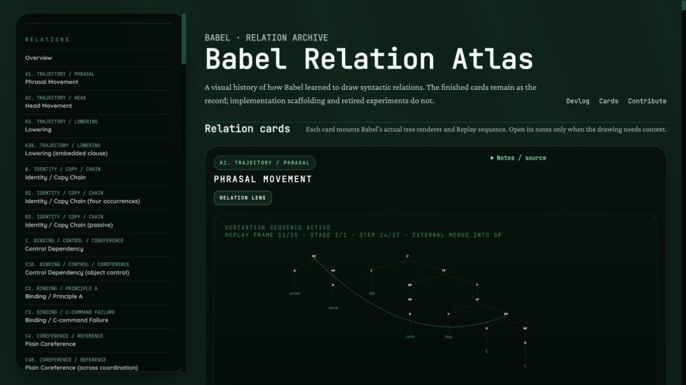
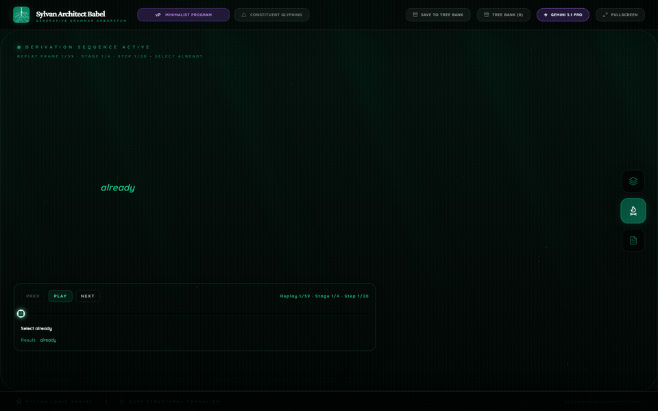
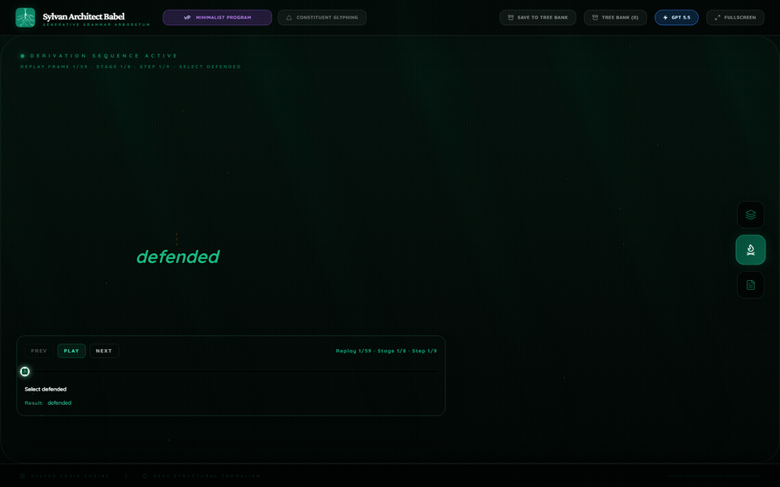
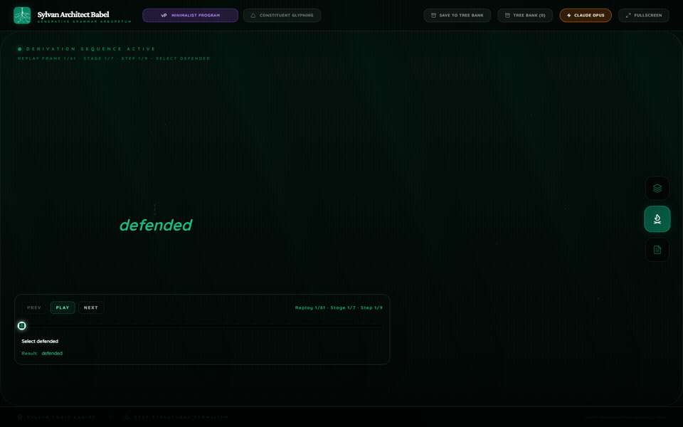

This section collects short papers and devlogs produced from Babel benchmark batches.

## August 2026

### [Drawing an Open-Ended Syntax: The Babel Relation Atlas](./visual-relations-atlas/)

Research devlog and interactive atlas: how Babel turns open, model-authored syntactic relations into finite, inspectable renderer marks without pretending that deterministic code can enumerate every relation syntacticians may need.

- Date: August 8, 2026
- Interactive artifact: [Babel Relation Atlas](./visual-relations-atlas/atlas.html)
- Focus: 102 live relation cards, source-backed visual conventions, Replay timing, safe fallback behavior, and an open contribution path for missing relations

## June 2026

### [Low Reasoning Effort On A Tiny Babel Derivation](./provider-reasoning-effort-mia-laughed-2026-06-03/)

Mini research devlog: Gemini 3.1 Pro, GPT-5.5, and Claude Opus 4.8 at low reasoning effort on the tiny Minimalist sentence `Mia laughed.`

- Date: June 3, 2026
- Assets: [provider-reasoning-effort-mia-laughed-2026-06-03](./assets/provider-reasoning-effort-mia-laughed-2026-06-03/)
- Focus: reasoning-effort scouting, compact derivation stages, low-effort token/time/cost comparison, and renderer lifecycle fixes for explicit movement relations

| Gemini 3.1 Pro Low | GPT-5.5 Low | Claude Opus 4.8 Low |
| --- | --- | --- |
|  |  |  |

## May 2026

### [Frontier Models On A Harder Babel Derivation](./frontier-provider-high-thesis-2026-05/)

Mini research devlog: Gemini 3.1 Pro, GPT-5.5, and Claude Opus 4.7 on a longer Minimalist wh-question with passive, embedding, and successive-cyclic movement.

- Date: May 31, 2026
- Assets: [frontier-provider-high-thesis-2026-05](./assets/frontier-provider-high-thesis-2026-05/)
- Focus: harder derivational staging, provider contract discipline, passive subject movement, successive-cyclic wh movement, renderer stabilization, and API cost comparison

| Gemini 3.1 Pro | GPT-5.5 diagnostic repair | Claude Opus 4.7 |
| --- | --- | --- |
|  |  |  |

### [Three Frontier Models Under One Babel Prompt](./frontier-provider-wh-question-2026-05/)

Mini research devlog: a one-sentence Babel comparison of Gemini 3.1 Pro, GPT-5.5, and Claude Opus 4.7 on a Minimalist wh-question.

- Date: May 16, 2026
- Assets: [frontier-provider-wh-question-2026-05](./assets/frontier-provider-wh-question-2026-05/)
- Focus: frontier-model syntactic commitment, derivation-stage prose, wh movement, do-support, and cost/time comparison

| Gemini 3.1 Pro | GPT-5.5 | Claude Opus 4.7 |
| --- | --- | --- |
|  |  |  |

## April 2026

### [From Tree-First to Derivation-First](./from-tree-first-to-derivation-first/)

Research Journal v1: why Babel had to be refactored, why derivation-first changed the system, and why smaller models now fall short of full Babel.

- Date: April 10, 2026
- Assets: [derivation-first-refactor-v1](./assets/derivation-first-refactor-v1/)
- Focus: refactor rationale, renderer repair, cost pressure, and smaller-model failure under the stronger Babel standard

| Refactored Gemini Portuguese Growth | Qwen Portuguese Growth |
| --- | --- |
|  |  |

## March 2026

### [One Hundred Trees, One Hundred Public Syntactic Theories](./one-hundred-trees-under-forced-commitment/)

Research Note v1: the first benchmark of public syntax in frontier language models.

- Date: March 13, 2026
- Data: [gauntlet100-v1-report.json](./data/gauntlet100-v1-report.json)
- Capture script: [gauntlet100_dual.cjs](./data/gauntlet100_dual.cjs)
- Full atlas: [all 100 trees with sentence-by-sentence analysis](./one-hundred-trees-under-forced-commitment/atlas/)

| Gemini 3.1 Pro | Gemini 3.1 Flash Lite |
| --- | --- |
|  |  |

### [Explicit Syntax Under Forced Commitment](./explicit-syntax-benchmark-random20/)

Mini Paper v1: a paired 20-case Babel benchmark of Gemini 3.1 Pro and Gemini 3.1 Flash Lite.

- Date: March 11, 2026
- Data: [random20-v1-report.json](./data/random20-v1-report.json)
- Capture script: [random20_dual_showcase.cjs](./data/random20_dual_showcase.cjs)

| Gemini 3.1 Pro | Gemini 3.1 Flash Lite |
| --- | --- |
|  |  |
