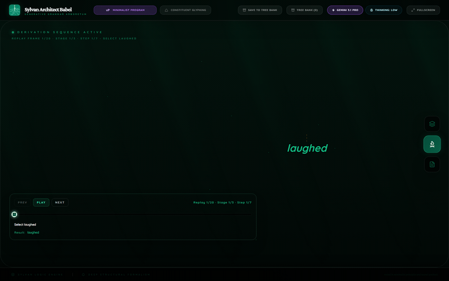
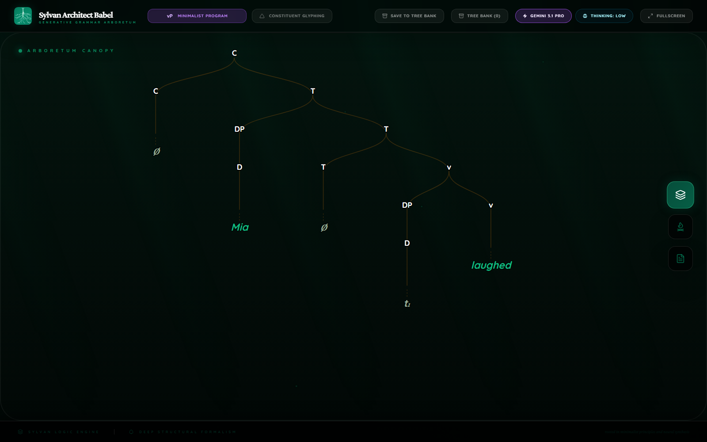
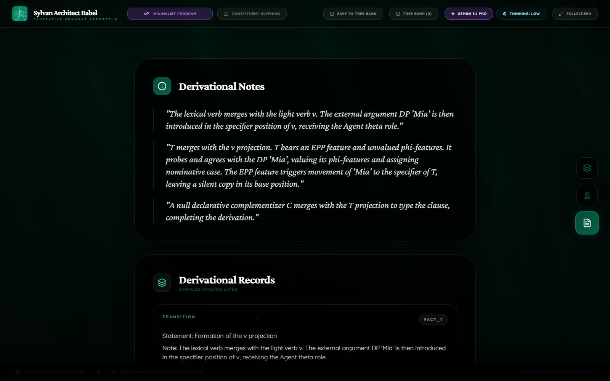
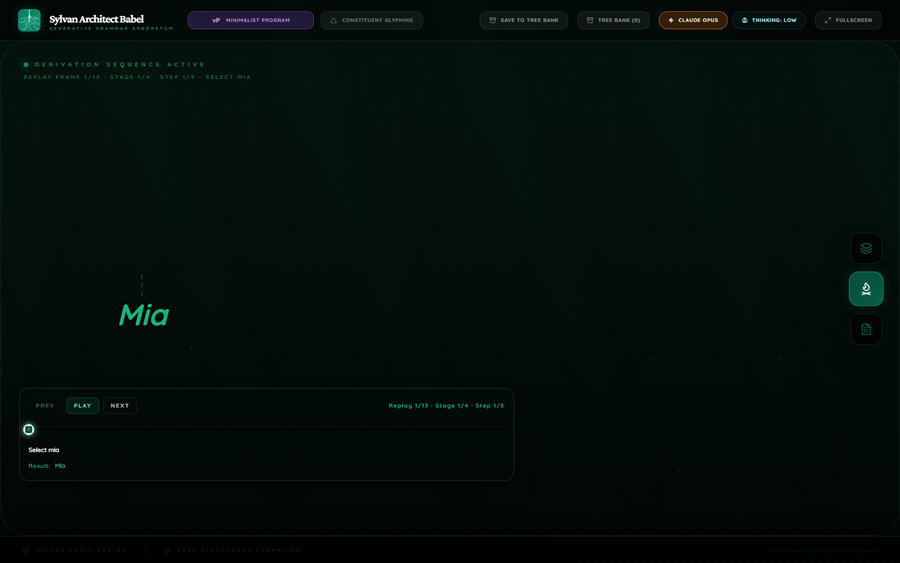
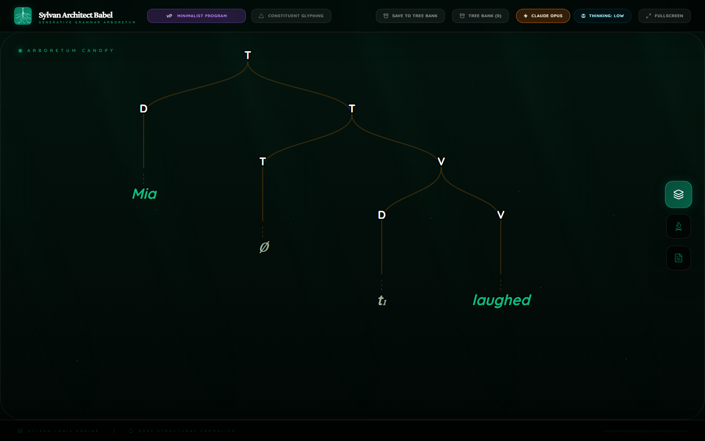
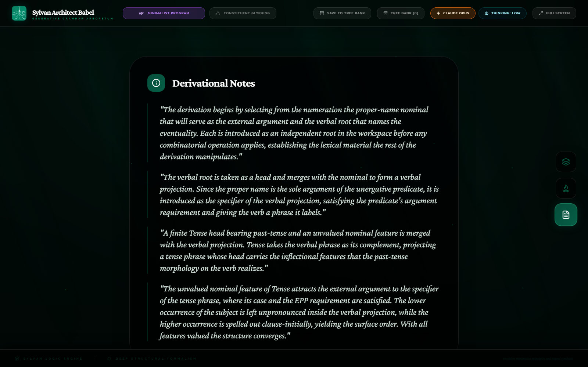
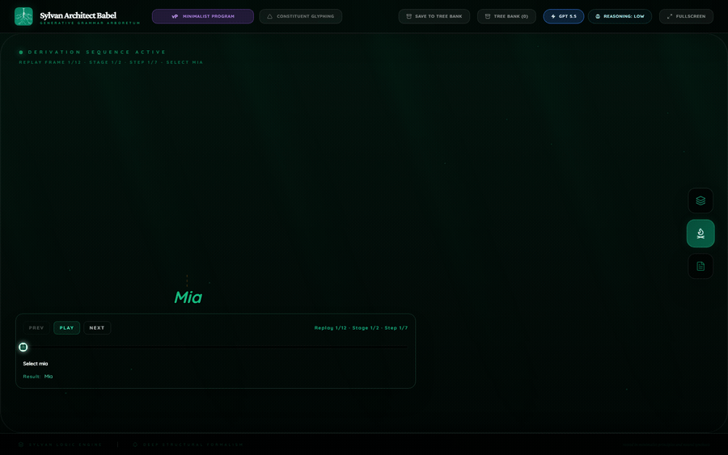
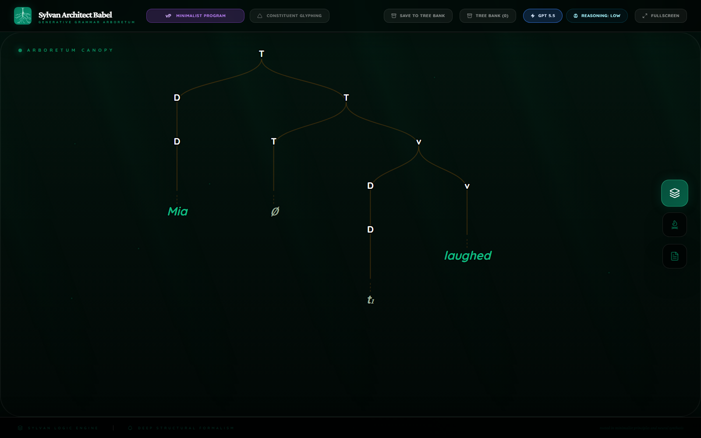
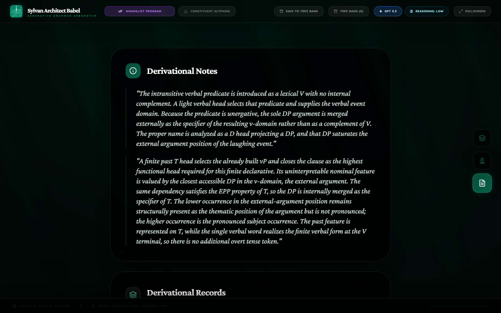

<div class="paper-hero">
  <p class="paper-kicker">Mini Research Devlog</p>
  <h1 class="paper-title">Low Reasoning Effort On A Tiny Babel Derivation</h1>
  <p class="paper-subtitle">A one-sentence scout run for reasoning-effort settings in Babel.</p>
  <div class="paper-meta-grid">
    <div class="paper-meta-item">
      <span class="paper-meta-label">Date</span>
      <p>June 3, 2026</p>
    </div>
    <div class="paper-meta-item">
      <span class="paper-meta-label">Sentence</span>
      <p><code>Mia laughed.</code></p>
    </div>
    <div class="paper-meta-item">
      <span class="paper-meta-label">Framework</span>
      <p>Minimalist Program</p>
    </div>
    <div class="paper-meta-item">
      <span class="paper-meta-label">Effort</span>
      <p>Low, one provider call per route</p>
    </div>
    <div class="paper-meta-item">
      <span class="paper-meta-label">Main Site</span>
      <a href="https://francisronge.github.io/sylvan-architect-babel/">Back to Sylvan Architect Babel</a>
    </div>
    <div class="paper-meta-item">
      <span class="paper-meta-label">Asset Source</span>
      <a href="https://github.com/francisronge/sylvan-architect-babel/tree/main/docs/research/assets/provider-reasoning-effort-mia-laughed-2026-06-03">GitHub asset folder</a>
    </div>
  </div>
</div>

## Abstract

This run tested a deliberately tiny sentence at low reasoning effort across the three frontier routes currently under comparison in Babel: Gemini 3.1 Pro, GPT-5.5, and Claude Opus 4.8. Each provider received one parse request. There were no retries and no provider fallbacks.

All three routes produced usable derivational analyses for `Mia laughed.` after the compact-stage prompt fix. The result is encouraging, but narrow. Low effort can handle a very small intransitive clause. This does not prove that low effort is enough for real Babel benchmark sentences with embedding, wh-movement, passive structure, head movement, or multiple copy chains.

The run was also useful as renderer research. GPT exposed two renderer assumptions that were too brittle: relation index handling when an unrendered Agree relation precedes movement, and pending movement-target display when a stage snapshot already contains both lower and higher occurrences. Fixing those made the saved GPT render clean without changing the provider output.

## Method

The test sentence was intentionally simple. The goal was not linguistic difficulty. The goal was to scout whether low reasoning effort can still return a forward, sentence-specific Babel derivation under the current contract.

Rules for this run:

- one API call per provider route;
- no retries;
- no fallbacks;
- saved raw provider text, parsed payload, normalized bundle, render, replay GIF, token usage, timing, and estimated cost;
- renderer fixes were applied only to display/compile the saved model output, not to create a new model analysis.

Pricing estimates use saved provider usage fields and public provider pricing checked on June 3, 2026. For Gemini, billed output includes visible output plus thinking tokens. For GPT and Claude, the saved output token count is used directly. These are estimates, not invoices.

Pricing references: [OpenAI API pricing](https://openai.com/api/pricing/), [Claude pricing](https://claude.com/pricing), and [Gemini API pricing](https://ai.google.dev/gemini-api/docs/pricing).

| Route | Model | Effort | Stored elapsed time | Input tokens | Visible output tokens | Thinking tokens | Estimated API cost | Render frames |
| --- | --- | --- | ---: | ---: | ---: | ---: | ---: | ---: |
| Gemini | Gemini 3.1 Pro Preview | Low | 23.3s | 3,762 | 1,017 | 1,945 | $0.0431 | 20 |
| Claude | Claude Opus 4.8 | Low | 15.6s | 5,990 | 1,051 | 0 | $0.0562 | 13 |
| GPT | GPT-5.5 | Low | 33.3s | 3,701 | 1,705 | 0 | $0.0697 | 12 |

The Claude estimate uses the Opus-class `$5 / 1M input` and `$25 / 1M output` rate recorded in the artifact summary. The public pricing page currently lists that rate for the Opus family; the saved artifact model id is `claude-opus-4-8`.

## Result

Low effort did not collapse on this tiny sentence. The three providers returned compact derivations with enough structure for Babel to normalize, replay, and render:

- Gemini returned 3 derivation stages.
- Claude returned 4 derivation stages.
- GPT returned 2 derivation stages.

For this sentence, GPT's 2-stage result is acceptable. The first stage builds the verbal predicate with the subject in the verbal domain. The second stage adds finite T and records the subject movement relation. A numerical stage floor would be wrong here; it previously caused the model to pad or repeat structure.

The important constraint is not stage count. The important constraint is whether each stage makes a real sentence-specific derivational claim witnessed by `workspaceForest`.

## Gemini 3.1 Pro Low

Gemini produced the most compact successful derivation. It built the verbal domain, then introduced a null subject-landing shell, finite T, and subject movement, then added the null declarative C. The movement relation is explicit and rendered as a phrasal trajectory from the lower DP position to the higher DP position.

| Replay | Canopy | Notes |
| --- | --- | --- |
|  |  |  |

### Linguistic Audit

Gemini is good enough on this sentence. It gives a standard intransitive-clause derivation: a verbal predicate, a DP subject, finite T, subject movement, and a null declarative C. It also keeps the Agree relation separate from the visible movement arrow, which matches the renderer rule that only movement gets arrows.

The analysis is compact rather than rich. That is acceptable here because the sentence is tiny. The same compactness would not be enough evidence for a hard benchmark sentence.

## Claude Opus 4.8 Low

Claude returned the cleanest low-effort output. It built the proper-name DP, selected the intransitive predicate, merged the subject with the verbal domain, introduced T, moved the subject, and closed the clause with a null C. The render is stable and visually ordinary.

| Replay | Canopy | Notes |
| --- | --- | --- |
|  |  |  |

### Linguistic Audit

Claude's output is the best pedagogical object in this small run. It is compact, but it still separates the lexical predicate from the later functional structure. It does not pad the derivation with generic stages. It also does not need renderer repair beyond the general fixes already applied to the replay engine.

The main limitation is only the test size. `Mia laughed.` does not stress the route.

## GPT-5.5 Low

GPT returned a valid compact parse, but it exposed renderer weaknesses. The model labeled DP ids with head labels in places such as `DP1` with label `D`. It also placed an unrendered Agree relation before the movement relation in `visualRelations`. The old renderer filtered out Agree, then used the filtered relation index as if it were the original authored relation index. That made the movement frame disappear.

The current renderer now preserves the original relation index before filtering. It also treats same-stage movement targets as pending until the authored movement relation frame fires. That means the lower occurrence stays overt before movement, and the higher occurrence does not appear as an independent duplicate before movement.

| Replay | Canopy | Notes |
| --- | --- | --- |
|  |  |  |

### Linguistic Audit

GPT's model output is acceptable for this tiny sentence, but it is less renderer-friendly than Claude's. The stage granularity is more compressed, and the stage snapshot already contains both the lower silent occurrence and the higher pronounced occurrence. That is legal only because the stage also authors the movement relation. The replay compiler must therefore show the pre-movement lifecycle carefully: lower occurrence active first, then movement, then lower occurrence silent.

The final render now does that. This is a renderer stabilization result, not a new model output.

## Renderer Lessons

This run fixed three general renderer problems:

1. Authored relation indexes are now preserved before filtering visual relations. If a non-rendered relation such as Agree appears before movement, the movement relation still gets the correct authored index.
2. Movement-target projection steps are folded into the movement frame when they are only the target side of an explicit movement relation. This prevents a moved item from appearing overtly in the landing site before movement.
3. Authored projection-shell labels can be canonicalized from explicit ids when the model gives a projected id with a head label. This fixes display cases like `DP1` with label `D` without inventing a new syntactic node.

These are renderer fixes. They do not add syntax. They preserve the model's authored objects and relation anchors while enforcing Babel's replay lifecycle.

## What This Means

Low effort is viable for a tiny smoke sentence. It is not yet a shipping setting for hard Babel derivations.

The practical next step is a graded effort ladder:

- keep low effort for very small smoke probes;
- test medium on simple classroom sentences;
- keep high or stronger effort for benchmark-grade sentences until repeated evidence shows lower effort preserves derivational quality.

This result is still good news. The renderer now handles a failure class that previously made good model output look broken, and all three frontier routes can produce a saved, inspectable low-effort derivation for the simplest possible clause.

## Saved Local Artifacts

| Route | Artifact folder |
| --- | --- |
| Gemini | `.local-tests/provider-effort-2026-06-03-gemini-low-mia-laughed-prompt-floor-removed` |
| Claude | `.local-tests/provider-effort-2026-06-03-claude-low-mia-laughed` |
| GPT | `.local-tests/provider-effort-2026-06-03-gpt-low-mia-laughed` |

Verification commands run after the renderer fixes:

```powershell
node scripts\verifyReplayRegression.mjs .local-tests\provider-effort-2026-06-03-gemini-low-mia-laughed-prompt-floor-removed\render-gemini-low-current
node scripts\verifyReplayRegression.mjs .local-tests\provider-effort-2026-06-03-claude-low-mia-laughed\render-claude-low-current
node scripts\verifyReplayRegression.mjs .local-tests\provider-effort-2026-06-03-gpt-low-mia-laughed\render-gpt-low-current
npm.cmd run build
```

All four checks passed.
